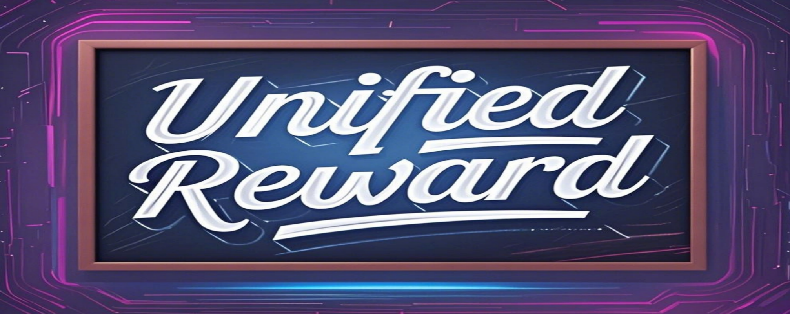

<p align="center" width="100%">

</p>
<div align="center">
    <h1 align="center"> Unified Reward Model for Multimodal Understanding and Generation
    </h1>
</div>

<a href="https://arxiv.org/pdf/2503.05236">
</a>
<a href="https://codegoat24.github.io/UnifiedReward/">
</a>


<a href="https://huggingface.co/CodeGoat24/UnifiedReward-0.5b">

</a>
<a href="https://huggingface.co/CodeGoat24/UnifiedReward-7b">

</a>
<a href="https://huggingface.co/CodeGoat24/UnifiedReward-7b-v1.5">

</a>
<br>
<a href="https://huggingface.co/CodeGoat24/UnifiedReward-qwen-3b">

</a>
<a href="https://huggingface.co/CodeGoat24/UnifiedReward-qwen-7b">

</a>
<a href="https://huggingface.co/CodeGoat24/UnifiedReward-qwen-32b">

</a>

[](https://huggingface.co/collections/CodeGoat24/unifiedreward-models-67c3008148c3a380d15ac63a)
[](https://huggingface.co/collections/CodeGoat24/unifiedreward-models-gguf-683fe14b5e2b8422049f45ca)
[](https://huggingface.co/collections/CodeGoat24/unifiedreward-training-data-67c300d4fd5eff00fa7f1ede)

We release the **UnifiedReward** -- **the first unified reward model for multimodal understanding and generation assessment**, enabling both pairwise ranking and pointwise scoring, which can be employed for vision model preference alignment. 


🔥🔥 We release UnifiedReward-qwen-[[3b](https://huggingface.co/CodeGoat24/UnifiedReward-qwen-3b)/[7b](https://huggingface.co/CodeGoat24/UnifiedReward-qwen-7b)/[32b](https://huggingface.co/CodeGoat24/UnifiedReward-qwen-32b)], the more powerful unified reward models built upon [Qwen2.5-VL-Instruct](https://huggingface.co/collections/Qwen/qwen25-vl-6795ffac22b334a837c0f9a5)!!

🔥 We release vLLM inference code for UnifiedReward-qwen in `vllm_qwen` directory!

🔥 We release SGLang inference code for UnifiedReward-llava in `sglang_llava` directory!

😊 We appreciate the excellent work [Delving into RL for Image Generation with CoT: A Study on DPO vs. GRPO](https://arxiv.org/pdf/2505.17017), which provides further evidence of **the robustness and effectiveness of UnifiedReward in image generation RL** tasks.

| Method     | HPS | ImageReward | UnifiedReward |
|------------|-----------|-----------|-----------|
|  Janus-Pro + DPO        | 77.3      | 77.7      | **80.0**      |
| Janus-Pro + GRPO       | 79.2      | 79.3      | **81.0**      |
| Janus-Pro + Best-of-4  | 82.1      | 82.4      | **84.5**      |

😊 We appreciate the [Flow-GRPO](https://github.com/yifan123/flow_grpo) team for using UnifiedReward-7B as their **image generation quality evaluation metric**!

😊 We appreciate the [mradermacher](https://huggingface.co/mradermacher) team for providing the [GGUF](https://huggingface.co/collections/CodeGoat24/unifiedreward-models-gguf-683fe14b5e2b8422049f45ca) version of our models!!


## 🔥🔥🔥 **UnifiedReward-Think**

<div align="left">
    <h3 align="left"> 
Unified Multimodal Chain-of-Thought Reward Model through Reinforcement Fine-Tuning
    </h3>

<a href="https://arxiv.org/pdf/2505.03318">
</a>
<a href="https://codegoat24.github.io/UnifiedReward/think">
</a>
<a href="https://huggingface.co/CodeGoat24/UnifiedReward-Think-7b">

</a>

<a href="https://huggingface.co/CodeGoat24/UnifiedReward-Think-qwen-7b">

</a>

</div>

We release **UnifiedReward-Think** -- **the first unified multimodal CoT reward model**, capable of multi-dimensional, step-by-step long-chain reasoning for both visual understanding and generation reward tasks.

Please refer to the [project page](https://github.com/CodeGoat24/UnifiedReward/tree/main/UnifiedReward-Think) for details.

🔥🔥 We release [UnifiedReward-Think-qwen-7b](https://huggingface.co/CodeGoat24/UnifiedReward-Think-qwen-7b), a more powerful unified multimodal CoT reward model built upon [UnifiedReward-qwen-7b](https://huggingface.co/CodeGoat24/UnifiedReward-qwen-7b)!!!!

🔥🔥 We released Gradio for UnifiedReward-Think!
<p align="left" width="100%">

</p>

## 🔥 News
😊 We are actively gathering feedback from the community to improve our models. **We welcome your input and encourage you to stay updated through our repository**!!

Please leave us a star ⭐ if you find our work helpful.
- [2025/5] 🔥🔥 We released [UnifiedReward-qwen-[[3b](https://huggingface.co/CodeGoat24/UnifiedReward-qwen-3b)/[7b](https://huggingface.co/CodeGoat24/UnifiedReward-qwen-7b)/[32b](https://huggingface.co/CodeGoat24/UnifiedReward-qwen-32b)], the more powerful unified reward models built upon [Qwen2.5-VL-Instruct](https://huggingface.co/collections/Qwen/qwen25-vl-6795ffac22b334a837c0f9a5)!!(https://huggingface.co/Qwen/Qwen2.5-VL-7B-Instruct)! All its inference and evaluation codes are provided in `./inference_qwen` and `./benchmark_evaluation` directory, respectively.
- [2025/5] 🔥🔥 We released [UnifiedReward-Think-7b](https://huggingface.co/CodeGoat24/UnifiedReward-Think-7b), the first unified multimodal CoT reward model. See [project page](https://github.com/CodeGoat24/UnifiedReward/tree/main/UnifiedReward-Think) for details.
- [2025/4] 🔥🔥 We released [UnifiedReward-0.5B](https://huggingface.co/CodeGoat24/UnifiedReward-0.5b). Feel free to use it based on your needs.
- [2025/4] 🔥🔥 We updated [UnifiedReward-7B](https://huggingface.co/CodeGoat24/UnifiedReward-7b), incorporating valuable feedback from the community, and released [UnifiedReward-7B-v1.5](https://huggingface.co/CodeGoat24/UnifiedReward-7b-v1.5) by introducing pointwise scoring for generated images across three dimensions: alignment, coherence, and style, each rated on a continuous scale from 1 to 5.
  1. **Alignment** quantifies how well an image matches its prompt.
  2. **Coherence** assesses the logical consistency of the image and the absence of artifacts or visual glitches.
  3. **Style** reflects the visual appeal of the image, independent of the prompt.

  Welcome to try the latest version, and the inference code is in `inference_qwen/image_generation/qwen_point_score_ACS_image_generation.py` and `./inference/point_score_ACS_image_generation.py`.
- [2025/3] 🔥🔥 We released all training [datasets](https://huggingface.co/collections/CodeGoat24/unifiedreward-training-data-67c300d4fd5eff00fa7f1ede) and model [checkpoints](https://huggingface.co/collections/CodeGoat24/unifiedreward-models-67c3008148c3a380d15ac63a).
- [2025/3] 🔥🔥 We released all training, inference, and evaluation code.
- [2025/3] 🔥 We launched the [project page](https://codegoat24.github.io/UnifiedReward/) and [paper](https://arxiv.org/pdf/2503.05236).


## 🏁 Compared with Current Reward Models

|  Reward Model | Method| Image Generation | Image Understanding | Video Generation | Video Understanding
| :-----: | :-----: |:-----: |:-----: | :-----: | :-----: |
|  [PickScore](https://github.com/yuvalkirstain/PickScore) |Point | √ |  | ||
|  [HPS](https://github.com/tgxs002/HPSv2) | Point | √ |  |||
|  [ImageReward](https://github.com/THUDM/ImageReward) |  Point| √|  |||
|  [LLaVA-Critic](https://huggingface.co/lmms-lab/llava-critic-7b) | Pair/Point | | √  |||
|  [IXC-2.5-Reward](https://github.com/InternLM/InternLM-XComposer) | Pair/Point | | √  ||√|
|  [VideoScore](https://github.com/TIGER-AI-Lab/VideoScore) | Point |  |  |√ ||
|  [LiFT](https://github.com/CodeGoat24/LiFT) | Point |  |  |√| |
|  [VisionReward](https://github.com/THUDM/VisionReward) | Point |√  | |√||
|  [VideoReward](https://github.com/KwaiVGI/VideoAlign) | Point |  |  |√ ||
|  UnifiedReward (Ours) | Pair/Point | √ | √ |√|√|

<details>
<summary>VLRewardBench Comparison Results</summary>

| Models               | General | Hallu. | Reason. | Overall Accuracy | Macro Accuracy |
|----------------------|---------|--------|---------|------------------|---------------|
| Gemini-1.5-Pro      | 50.8    | 72.5   | 64.2    | 67.2         | 62.5          |
| GPT-4o              | 49.1    | 67.6   | **70.5** | 65.8             | 62.4          |
| LLaVA-Critic        | 47.4    | 38.5   | 53.8    | 46.9             | 46.6          |
| OV-7B           | 32.2    | 20.1   | 57.1    | 29.6             | 36.5          |
| **UnifiedReward**   | 76.5 | 58.1 | 65.1 | 67.5             | 66.6      |
</details>

---

<details>
<summary>GenAI-Bench(Image) Comparison Results</summary>

| Method            | GenAI-Bench |        |
|------------------|------------|--------|
|                  | tau        | diff   |
| PickScore       | 53.2       | 67.2   |
| HPSv2           | 51.6       | 68.4   |
| ImageReward     | 47.8       | 65.0   |
| VisionReward    | 46.8       | 66.4   |
| OV-7B        | 39.7       | 53.2   |
| **UnifiedReward** | 54.8  | 70.9 |

</details>

---

<details>
<summary>GenAI-Bench(Video) and VideoGen-Reward Comparison Results</summary>

| Method            | GenAI-Bench |        | VideoGen-Reward |        |
|------------------|------------|--------|-----------------|--------|
|                  | tau        | diff   | tau             | diff   |
| VideoScore      | 46.2       | 70.6   | 42.1            | 49.9   |
| LiFT            | 41.2       | 60.1   | 40.6            | 58.3   |
| VisionReward    | 52.1       | 73.1   | 57.4            | 68.2   |
| VideoReward     | 50.2       | 73.3   | 60.1            | 73.9   |
| OV-7B        | 40.8       | 51.4   | 40.4            | 50.2   |
| **UnifiedReward** | 60.7  | 77.2 | 66.6       | 79.3 |
</details>


##  🔧 Environment Set Up

1. Clone this repository and navigate to the UnifiedReward folder:
```bash
git clone https://github.com/CodeGoat24/UnifiedReward.git
cd UnifiedReward
```

2. Install the inference package:
```bash
conda create -n unifiedreward python=3.10 -y
conda activate unifiedreward
pip install --upgrade pip  
pip install -e ".[train]"
pip install flash_attn==2.5.8 --no-build-isolation
```

## 🚀 Inference

For Qwen2.5-VL based UnifiedReward models, you should first install the inference packages as follows:
```bash
pip install git+https://github.com/huggingface/transformers accelerate qwen-vl-utils[decord]==0.0.8
```

We provide reference pair ranking and point score inference code for each task in the `./inference` and `./inference_qwen` directories.

```bash
inference
├── image_generation                  
    ├── pair_rank_image_generation.py            
    └── point_score_image_generation.py         
├── video_understanding                 
    ├── pair_rank_video_understanding.py            
    └── point_score_video_understanding.py
... 
```

Note that our model is not constrained to a fixed input prompt style.
You can flexibly adjust inputs based on your requirements.

### 1. vLLM Inference
We provide vLLM inference code for UnifiedReward-qwen in `vllm_qwen` directory.

1. Install vLLM
```bash
pip install vllm==0.9.0.1 transformers==4.52.4
```
2. Deploy vLLM Server
```bash
bash vllm_qwen/vllm_server.sh
```

3. Inference Request to vLLM Server
```bash
python vllm_qwen/vllm_inference.py
```

### 2. SGLang Inference
We provide SGLang inference code for UnifiedReward-llava in `sglang_llava` directory.

1. Install SGLang
```bash
pip install "sglang[all]"
```
2. Deploy SGLang Server
```bash
bash sglang_llava/sglang_server.sh
```

3. Inference Request to SGLang Server
```bash
python sglang_llava/sglang_inference.py
```


## 💻 Training UnifiedReward

### 1. Training based on Qwen2.5-VL-Instruct (Recommended)
We use [LLaMA-Factory](https://github.com/hiyouga/LLaMA-Factory) to train the SFT model.

1. Clone the [LLaMA-Factory](https://github.com/hiyouga/LLaMA-Factory) repository and install the dependencies.

```bash
git clone https://github.com/hiyouga/LLaMA-Factory.git
cd LLaMA-Factory
pip install -e ".[torch,metrics]"
```

Follow its README to prepare our released [datasets](https://huggingface.co/collections/CodeGoat24/unifiedreward-training-data-67c300d4fd5eff00fa7f1ede).

2. Run the following command to train the SFT model.

```bash
llamafactory-cli train examples/train_full/qwen2_5vl_full_sft.yaml
```

### 2. Training based on LLaVA-Onevision

#### 2.1 Unified Preference Training Dataset Preparation
Please download our constructed unified preference dataset from [Huggingface](https://huggingface.co/collections/CodeGoat24/unifiedreward-training-data-67c300d4fd5eff00fa7f1ede) and put it in `./dataset/`.

```
dataset
├── EvalMuse                  
    ├── pairwise            
    └── pointwise
    └── ...            
└── HPD                   
└── LiFT-HRA
└── LLaVA-Critic 
    ├── pairwise            
    └── pointwise
    └── ...
└── OIP
└── ShareGPTVideo
    ├── pairwise            
    └── pointwise
    └── ...      
└── VideoDPO 
└── VideoFeedback
└── train_data.yaml
```
#### 2.2 Training based on LLaVA-Onevision
```bash
bash train.sh
```


## ✨ Direct Preference Optimization 
### 🎨 Image and Video Understanding DPO
#### 1. Construct Preference data

The data for preference data construction should adhere to the following structure:
```bash
[
    {
    "prompt": "",
    "image": "",
    },
    ...
]
```
Then 
```bash
# image understanding 
cd preference_data_construction/image_understanding
python infer+sift.py # you need to fill the 'image_folder' and 'data_path' in this file

# video understanding 
cd preference_data_construction/video_understanding
python infer+sift.py # you need to fill the 'image_folder' and 'data_path' in this file
```

#### 2. Training
The training data format in `data.json` should adhere to the following structure:
```bash
[
    {
    "id": "",
    "image": "",
    "prompt": "",
    "chosen": "",
    "rejected": ""
    },
    ...
]
```
Then start training:
```bash
# image understanding 
bash dpo_image_understand_ov7b.sh 

# video understanding 
bash dpo_video_understand_llava_video_7b.sh
```

### 🖼️ Image Generation DPO
Prepare Environments
```bash
cd DiffusionDPO
conda create -n diffdpo python=3.10 -y
conda activate diffdpo
pip install -r requirements.txt
```

#### 1. Construct Preference data
Image Generation

The data for preference data construction should adhere to the following structure:
```bash
[
    {
    "prompt": "",
    },
    ...
]
```
Then 
```bash
python data_generation.py # you need to fill the 'data_path' in this file
```

Preference Pair Data Construction
```bash
python sift_dpo_data.py
```

#### 2. Training
The training data format in `data.json` should adhere to the following structure:
```bash
[
    {
        "id": "",
        "caption": "",
        "jpg_0": "", #chosen image path
        "jpg_1": "", #rejected image path
        "label_0": 1,
    },
    ...
]
 ```
Then start training:
```bash
bash launchers/turbo_dpo.sh
```

### 🎬 Video Generation DPO
Prepare Environments
```bash
cd VideoDPO
conda create -n videodpo python=3.10 -y
conda activate videodpo
pip install -r requirements.txt
```
Prepare Checkpoints

Run following instruction to download VideoCrafter checkpoints. 
```bash
mkdir -p checkpoints/vc2
wget -P checkpoints/vc2 https://huggingface.co/VideoCrafter/VideoCrafter2/resolve/main/model.ckpt
```

Please download our constructed T2V-Turbo model and its reference model from [Huggingface](https://huggingface.co/collections/CodeGoat24/unifiedreward-models-67c3008148c3a380d15ac63a) and put it in `./checkpoints/t2v-turbo`.

#### 1. Construct Preference data
Video Generation

The data for preference data construction should adhere to the following structure:
```bash
[
    {
    "prompt": "",
    },
    ...
]
```
Then 
```bash
bash data_generation.sh # you need to fill '--prompts_file' in this file
```

Preference Pair Data Construction

```bash
python sift_dpo_data.py
```

#### 2. Training
The training data format in `data.json` should adhere to the following structure:
```bash
[
    {
        "id": "",
        "caption": "",
        "chosen": "", # chosen video path
        "rejected": "", # rejected video path
    },
    ...
]
```
Then start training:
```bash
bash run.sh
```

## 🚀 Evaluation
We provide several evaluation code in `./benchmark_evaluation` directory. 
### Reward model
We provide evaluation code for [GenAI-Bench-Video](https://github.com/TIGER-AI-Lab/GenAI-Bench), [GenAI-Bench-Image](https://github.com/TIGER-AI-Lab/GenAI-Bench), [VideoGen-RewardBench](https://huggingface.co/datasets/KwaiVGI/VideoGen-RewardBench) and [VL-RewardBench](https://huggingface.co/datasets/MMInstruction/VL-RewardBench) benchmarks.

### Video Understanding
We provide evaluation code for [MSRVTT](https://github.com/xudejing/video-question-answering), [MSVD](https://github.com/xudejing/video-question-answering), and [TGIF](https://github.com/YunseokJANG/tgif-qa) benchmarks while using the [VLMEvalKit](https://github.com/open-compass/VLMEvalKit) toolkit for evaluating LongVideoBench, MLVU, and Video-MME benchmarks with 64 input frames.

### Image Understanding
We use [LMMs-Eval](https://github.com/EvolvingLMMs-Lab/lmms-eval) toolkit to evaluate LLaVABench, WildVision, LLaVABench-Wilder, LiveBench, and MMHal benchmarks.

### Image Generation
We utilize the image reward model,
i.e., [PickScore](https://github.com/yuvalkirstain/PickScore), [HPS](https://github.com/tgxs002/HPSv2) and [ImageReward](https://github.com/THUDM/ImageReward) for
quality assessment. 

### Video Generation
[VBench](https://github.com/Vchitect/VBench) is used for video generation assessment.

## 📧 Contact

If you have any comments or questions, please open a new issue or feel free to contact [Yibin Wang](https://codegoat24.github.io).

## 🤗 Acknowledgments
In this work, reward model and image/video understanding DPO code is based on [LLaVA-Next](https://github.com/LLaVA-VL/LLaVA-NeXT), while image and video generation DPO is based on [DiffusionDPO](https://github.com/SalesforceAIResearch/DiffusionDPO) and [VideoDPO](https://github.com/CIntellifusion/VideoDPO). 

We also utilize [LMMs-Eval](https://github.com/EvolvingLMMs-Lab/lmms-eval) and [VLMEvalKit](https://github.com/open-compass/VLMEvalKit) toolkits for evaluation.

Thanks to all the contributors!

## ⭐ Citation
```bibtex
@article{UnifiedReward-Think,
  title={Unified Multimodal Chain-of-Thought Reward Model through Reinforcement Fine-Tuning.},
  author={Wang, Yibin and Li, Zhimin and Zang, Yuhang and Wang, Chunyu and Lu, Qinglin, and Jin, Cheng and Wang, Jiaqi},
  journal={arXiv preprint arXiv:2505.03318},
  year={2025}
}
```
```bibtex
@article{UnifiedReward,
  title={Unified Reward Model for Multimodal Understanding and Generation.},
  author={Wang, Yibin and Zang, Yuhang and Li, Hao and Jin, Cheng and Wang, Jiaqi},
  journal={arXiv preprint arXiv:2503.05236},
  year={2025}
}
```
