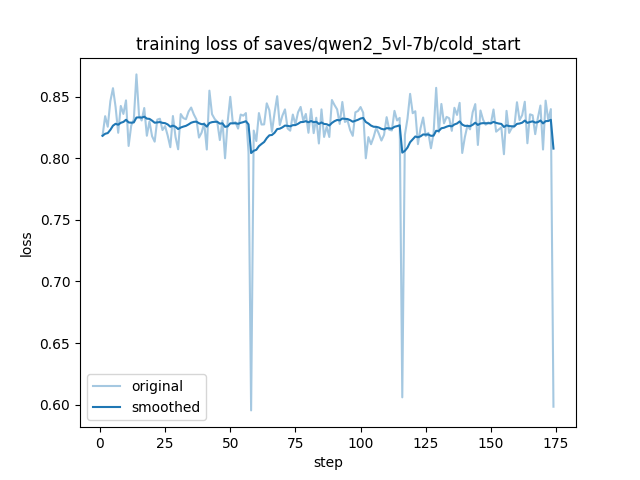
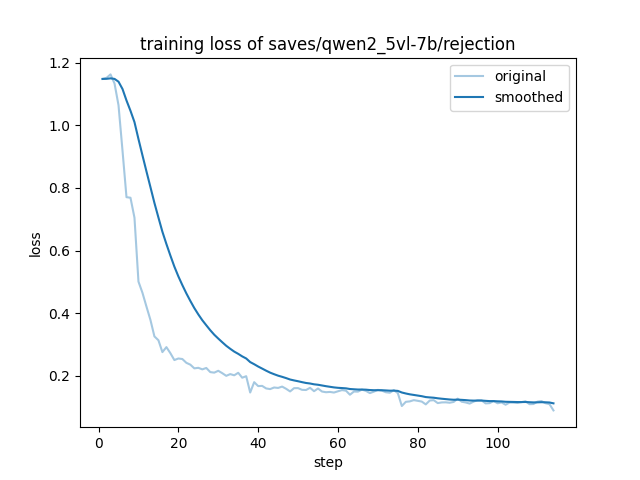
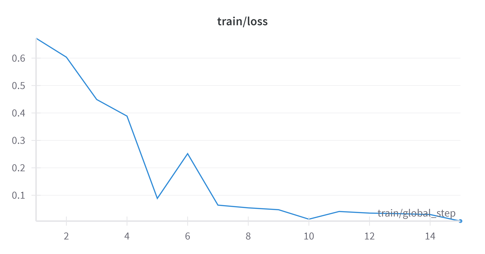
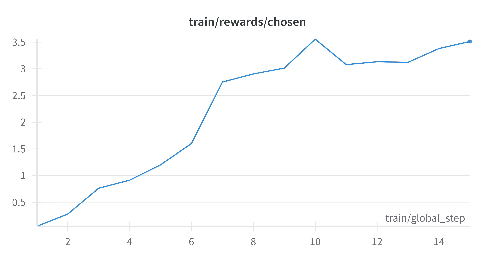
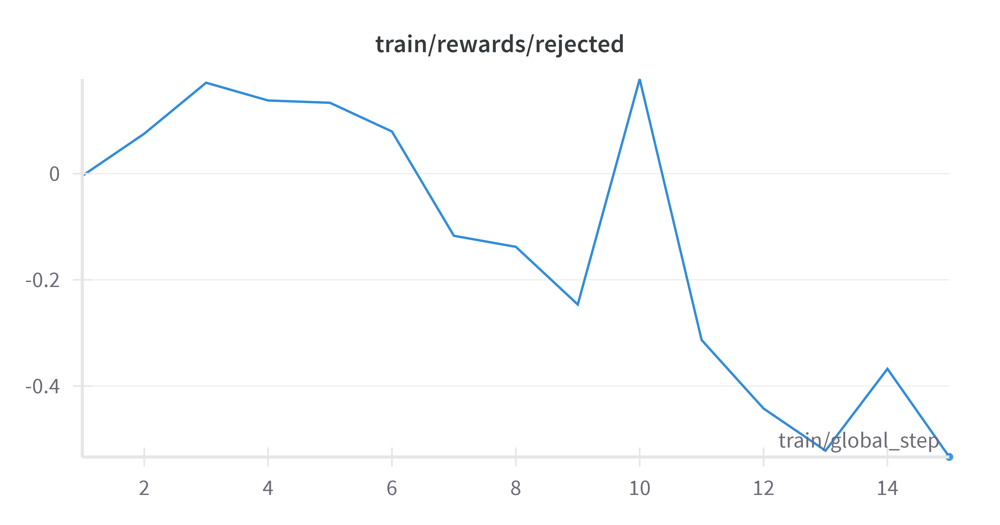

# The Experiment for Unifiedreward-think-qwen trained by DPO

本项目包含模型三个训练阶段的关于数据预处理，数据集构建以及微调的全部代码。

## 目录结构

- qwen_cold_start.yaml （stage1 配置）
- image_stream_gpt.py（推理代码）
- rejection.yaml（stage2 配置）
- merge_json.py（DPO数据集构造代码）
- DPO_VL.py（stage3 训练文件）
- dataset（含有添加的数据集及示例）

## 复现流程

### Stage1

1. 数据准备：按照github原仓库所需的数据，以及对应的url进行下载和解压。所有文件位于./dataset内

2. 开始训练：按照llava的超参数对Qwen3的微调文件进行配置。按照[LLama-factory](https://llamafactory.readthedocs.io/zh-cn/latest/getting_started/data_preparation.html)对数据格式的要求完善data_info.json。

   ```shell
   llamafactory-cli train cold_start.yam
   ```



### Stage2

1. 数据准备：为了加快推理的速度，使用vLLM service以及异步的数据推理，得到rejection 阶段所使用的数据。受限于7B模型所需的实验环境（A800-80G*2）使用受限。为了说明整体流程的可行性，本文后续以作者构建的EvalMuse数据集为例。参考vllm的教程[开启vllm serve]([CLI Reference - vLLM](https://docs.vllm.ai/en/stable/cli/index.html))

   ```shell
   ## 推理得到stage2 训练所需数据集
   python image_stream_gpt.py
   ```

   本项目在推理文件中将数据读取，格式整理，vllm推理，判断及保存进行了解耦。通过对路径及特定函数的修改可以处理所有数据集

2. 开始训练：按照llava的超参数对Qwen3的微调文件及进行配置

   ```shell
   llamafactory-cli train rejection.yaml
   ```



### Stage3

1. 数据准备：本issue目的在于探索Bradley-terry方式进行COT的强化学习训练。因此本项目考虑采用DPO的方式构建数据集并进行相应的RL训练。考虑到DPO训练需要构建chosen以及rejected两方面回答。因此本项目一方面使用Stage2 中的错误COT response $R_{s2w}$，另一方面使用训练完成UR-Thinking-Qwen对数据集进行推理，得到其判断正确的COT response $R_{ur}$。取两者的并集，构成DPO所需的数据集。

   ```shell
   python merge_dpo.py
   ```

2. 开始训练：使用TRL-Based进行DPO方式的训练。

   ```shell
   accelerate lanuch DPO_VL.py --model_name_or_path --data_path --image_folder
   ```

   |  |  |  |
   | ------------------------------------------------------------ | ------------------------------------------------------------ | ------------------------------------------------------------ |

   能够看出添加的部分能够顺利完成DPO的训练，但是受限于实验设备，在小规模数据集的使用下，基本已经已经过拟合了。

## 下一步工作

上述流程说明了本项目用于DPO训练的可行性，但是由于推理以及训练的受限，导致只是用部分数据集完成了训练，后续是使用完整的数据构建DPO数据集完成模型的三阶段训练和作者公开的权重进行对比。